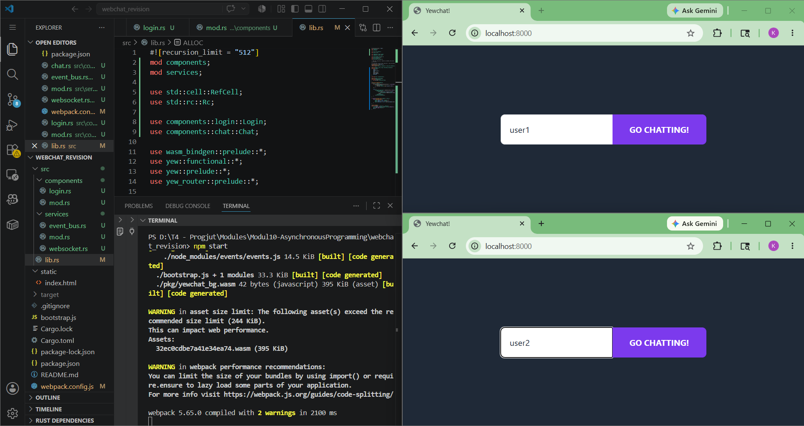
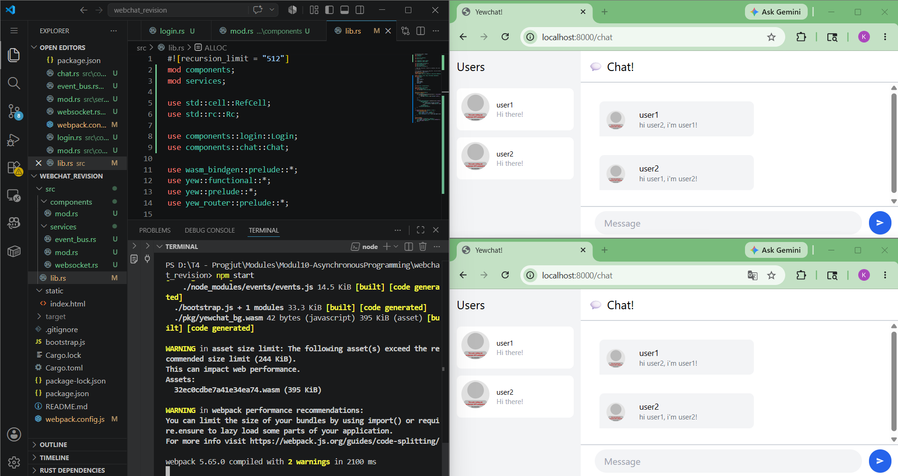
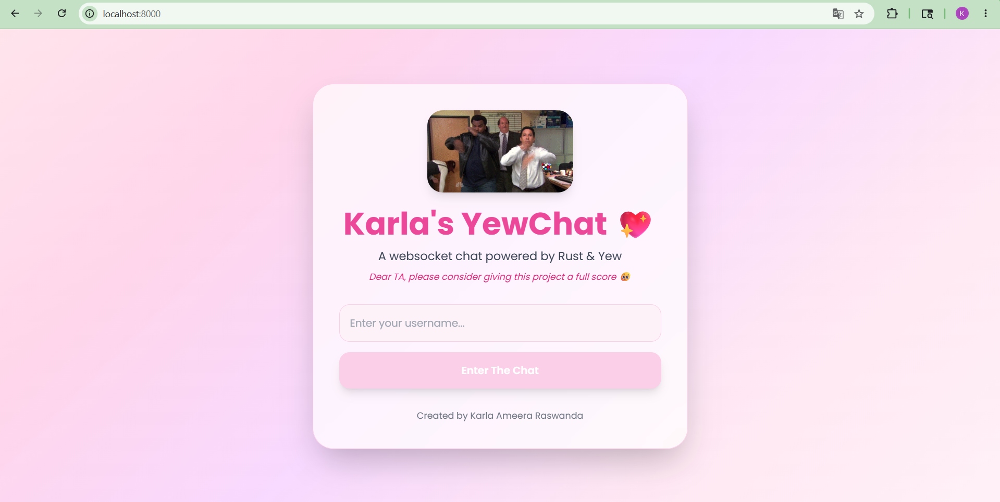
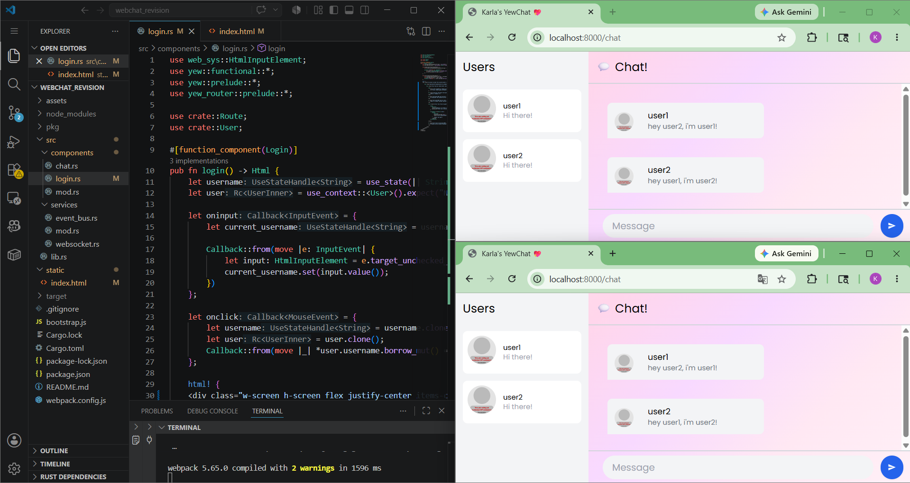

# YewChat 💬

> Source code for [Let’s Build a Websocket Chat Project With Rust and Yew 0.19 🦀](https://fsjohnny.medium.com/lets-build-a-websockets-project-with-rust-and-yew-0-19-60720367399f)

## Install

1. Install the required toolchain dependencies:
   ```npm i```

2. Follow the YewChat post!

## Branches

This repository is divided to branches that correspond to the blog post sections:

* main - The starter code.
* routing - The code at the end of the Routing section.
* components-part1 - The code at the end of the Components-Phase 1 section.
* websockets - The code at the end of the Hello Websockets! section.
* components-part2 - The code at the end of the Components-Phase 2 section.
* websockets-part2 - The code at the end of the WebSockets-Phase 2 section.

## Experiment 3.1: Original Code

### Screenshots

#### Login Page


#### Chat Page


### Reflection

This experiment demonstrates a web-based chat application built using Rust, Yew, WebAssembly, and WebSocket communication. The application successfully supports routing, shared context state, and real-time message exchange between users through a WebSocket server. The original tutorial uses several outdated dependencies and APIs, therefore some compatibility adjustments were required, including updates to `wasm-bindgen`, `bootstrap.js`, and the webpack build scripts. After these modifications, the project compiled and executed correctly on a modern Rust and Node.js environment. This experiment helped me understand how Yew integrates frontend components, routing, asynchronous communication, and shared state management in a Rust WebAssembly application.

## Experiment 3.2: Be Creative!

### Screenshots

#### Landing Page


#### Chat Page


### Reflection

In this experiment, I redesigned the webchat interface using a pink pastel theme with custom branding and personalized UI elements. The landing page now includes a meme GIF, gradient background, rounded card layout, and a personalized message addressed to the teaching assistant. I also customized the chat interface using pink color palettes while preserving the original WebSocket communication and routing functionality. These changes were implemented using TailwindCSS styling directly inside the Yew components and the main HTML template. This experiment helped me understand how frontend customization in Yew can improve user experience without changing the underlying application architecture.